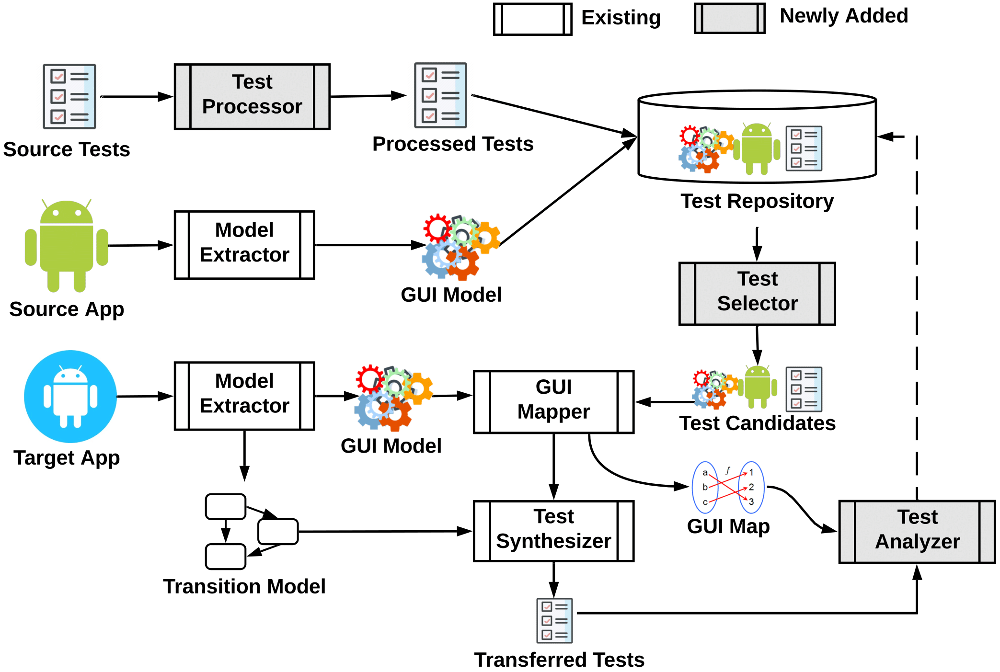

### Summary

Lorem ipsum dolor sit amet, consectetur adipiscing elit, sed do eiusmod tempor incididunt ut labore et dolore magna aliqua. Ut enim ad minim veniam, quis nostrud exercitation ullamco laboris nisi ut aliquip ex ea commodo consequat. Duis aute irure dolor in reprehenderit in voluptate velit esse cillum dolore eu fugiat nulla pariatur. Excepteur sint occaecat cupidatat non proident, sunt in culpa qui officia deserunt mollit anim id est laborum.

### Support Material

1. The manually written ground-truth test cases can be found [here](about:blank).

2. The source code for the framework's implementation, including the model extractor, GUI mapper, test processor, test analyzer, and ground truth mapping of GUI events to their canonical IDs, can be found [here](about:blank).
