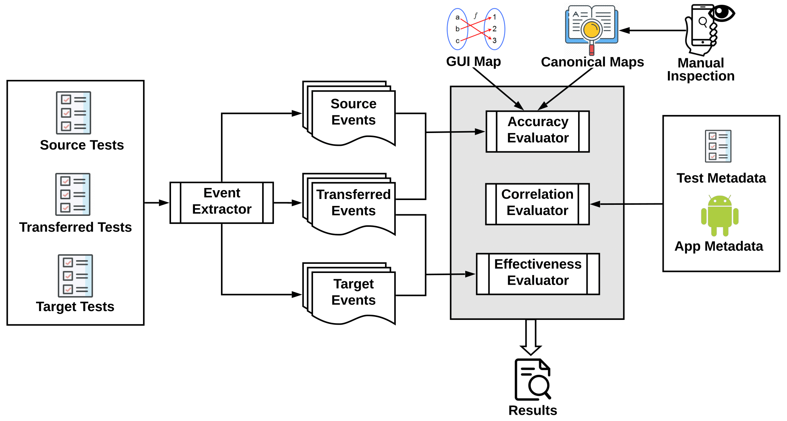

### Summary

UI testing is known to be tedious and time-consuming due to the manual effort required. Recent research has started to explore the opportunity for reusing existing UI tests for an app to automatically generate new tests for other apps. However, the evaluation of such techniques currently remains manual, unscalable, and unreproducible, which can waste efforts and impede progress in this emerging area. We introduce FrUITeR, a framework that automatically evaluates UI test reuse with a reproducible protocol. We use FrUITeR to conduct a preliminary case study in which we reuse 60 tests from 3 apps. We report several key findings aimed at improving UI test reuse that are missed by existing work.

### FrUITeR's Automated Workflow

### Supplementary Material

All the source code and artifacts can be downloaded [here](https://drive.google.com/file/d/1KRIU5BlUtJFdqlwc1_Pe8DysX3pY1N9x/view?usp=sharing).

1. FrUITeR's Event Extractor component is implemented in Java using [Soot](http://sable.github.io/soot/) with 200 SLOC. The source code can be found at /EventExtractor.

2. FrUITeR's Accuracy Evaluator and Utility Evaluator are implemented in Python with 860 SLOC. The source code can be found at /Evaluator.

3. The subject apps (Wish, Etsy, Geek), benchmark test cases (implemented in Java using [appium](http://appium.io/)), and the corresponding  ground-truth Canonical Maps can be found at /Benchmark.

4. The re-implementation of the core components extracted from [ATM](https://sites.google.com/view/apptestmigrator/) and [AppFlow](https://github.com/columbia/appflow) can be found at /GUIMapper.

5. The final dataset of the case study (3 subject apps, 60 test cases, 340 GUI events) can be found at /Dataset.
