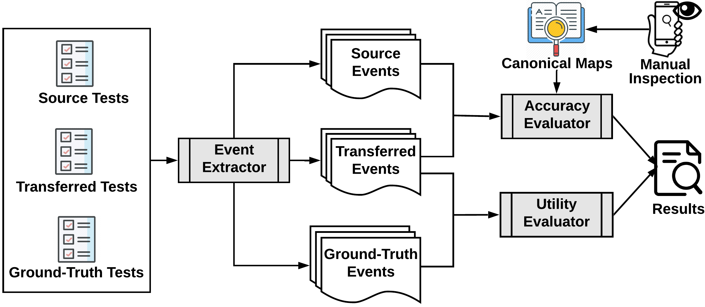

### Summary

Our abstract

### FrUITeR Reference Architecture

### FrUITeR Test Analyzer

### Subject Apps

### Benchmark Test Cases
 

### Support Material

1. The manually written ground-truth test cases can be found [here](https://drive.google.com/file/d/1NA9n7qTomWPTdll2X--vUhOOrpfWMomA/view).

2. The source code for the framework's implementation including different components (e.g., GUI Mapper, Test Processor); and Test Analyzer including ground truth mapping of GUI events to their canonical IDs, can be found [here](https://drive.google.com/file/d/1oMtoWUuzsXuNnOiUjxWEiLuQ25UrHZtW/view).

3. The results of our analysis on over 7,000 test transfer cases with 90 combinations of 10 subject apps (1MB .RData file), along with the .R scripts to analyze different statistics, can be found [here](https://drive.google.com/file/d/19nXkYnMq03WLmGDXyxIEcZuCpCWPh5uR/view).
